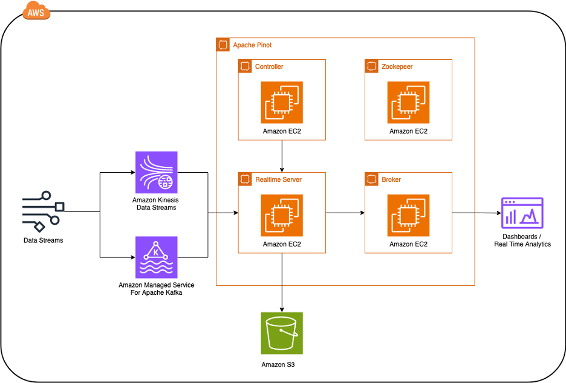

# Build real-time analytics solution with Apache Pinot on AWS

In this AWS Sample you will deploy an Apache Pinot Architecture using Amazon EC2. Apache Pinot is an Open Source real-time distributed OLAP datastore capable of
- low latency (10s of milliseconds)
- high concurrency (100s of thousands of Queries/Second), 
- near real-time data freshness
- handling petabyte-scale data volumes. 

It ingests data from both streaming and batch sources and organizes it into logical tables distributed across multiple nodes in a Pinot cluster, ensuring scalability.

## Architecture



## Solution Description

- Data is ingested from a real-time source, such as clickstream data from a website. For the purposes of this blog, we will be using the Amazon Kinesis Data Generator to simulate the production of events
- Events are captured in a streaming storage platform such as Amazon Kinesis Data Streams (KDS) or Amazon Managed Streaming for Apache Kafka (MSK) for downstream consumption
- The events are then ingested into the Real time Server within Apache Pinot, which is used to process data coming from streaming sources, such as Amazon Managed Streaming for Kafka and Amazon Kinesis Data Streams. Apache Pinot consists of logical tables which are partitioned into segments. Due to the time sensitive nature of streaming, events are directly written into memory as a consuming segments, which can be thought of as parts of an active table that are continuously ingesting new data. Consuming segments are available for query processing immediately, thereby enabling low latency and high data freshness
- Once the segments hit a threshold in terms of time or number of rows, it is moved into Amazon S3 which serves as deep storage for the Apache Pinot cluster. Deep storage is the permanent location for segment files. Segments used for batch processing are also stored here
- In parallel, the Pinot controller tracks the metadata of the cluster and performs actions required to keep the cluster in an ideal state. Its primary function is to orchestrate cluster resources as well as manage connections between resources within the cluster and data sources outside of it. Under the hood, the controller utilizes Apache Helix to manage cluster state, failover, distribution, and scalability and Apache Zookeeper to handles distributed coordination functions like leader election, locks, queue management and state tracking.
- To enable the distributed aspect of the Pinot architecture, the broker accepts queries from the clients and forwards it to servers and collect the results and send it back. It manages and optimizes the queries, distributes them across the servers, combines the results, and returns the result set. The broker sends the request to the right segments on the right servers, optimizes segment pruning, and splits the queries across servers appropriately. The results of the query are then merged and sent back to the requesting client
- The results of the queries are updated in real time in the Tableau dashboard

## Getting started

### Pre-requisites

Before you get started, make sure you have the following prerequisites:

**Deploying Apache Pinot**
- An AWS account
- A basic understanding of Amazon Simple Storage Service (S3), Amazon Elastic Compute Cloud (EC2), and Amazon Kinesis Data Streams (KDS)
- An AWS Identity and Access Management (IAM) role with permissions to access AWS CloudShell and create a KDS instance, EC2 instances, and S3 buckets (see Adding and removing IAM identity permissions for reference)
- Install Git to clone the code repository
- Install Node.js and npm to install packages

**Visualizing Using Tableau**
- Install Tableau Desktop to visualize data (for this post, 2023.3.0)
- Install  Kinesis data generator (KDG) using CloudFormation by following the instructions to stream sample web transactions into the Kinesis stream. The Amazon Kinesis Data Generator (KDG) makes it easy to send data to KDS stream.
- Download the Apache Pinot drivers from github repo (tableau/drivers folder) and copy to C:\Program Files\Tableau\Drivers folder for using Tableau Desktop on Windows. For other operating system like macOS, please refer to the instructions.
- Ensure all CloudFormation and Cloud Development Kit (CDK) templates are deployed in the same AWS region for all resources throughout the steps below

### Deployment

We will use AWS CDK CLI to deploy the solution.

This solution deploys the following:
- Amazon Kinesis Data Streams
- Amazon EC2 With AutoScaling Groups for Apache Zookeeper, and Apache Pinot Components
- Amazon EC2 Bastion host to configure Apache Pinot and create Tables
- Amazon S3 Bucket for storing Segments
- Elastic Load Balancer for Apache Pinot Controller
- AWS Lambda functions to handle table rebalancing when adding or removing nodes

Please replace with your account id and aws region

1. Bootstrap the AWS CDK
```shell
cdk bootstrap aws://<account-id>/<aws-region>
```
2. Git clone this repository
```shell
git clone https://github.com/aws-samples/real-time-analytics-with-apache-pinot-on-aws.git
```
3. Go into the repo
```shell
cd real-time-analytics-with-apache-pinot-on-aws
```
4. Install NPM libraries
```shell
npm install
```
5. Deploy stack. You will need to provide as parameter your IP address. This is the IP address from where you will be able to connect to the Apache Pinot Controller UI. Make sure the IP address finishes with the /32 subnet mask format.
```shell
cdk deploy --parameters IPAddress="<your-ip-address/32>"
```
6. Once the deployment finishes you can get from the CloudFormation output the Load Balancer DNS to access the UI


### Ingesting Data

To ingest data into the Amazon Kinesis Data Streams you can use the Kinesis Data Generator. Please follow the [instructions](https://awslabs.github.io/amazon-kinesis-data-generator/web/help.html#:~:text=the%20downloaded%20file.-,Access%20the%20KDG,-After%20the%20CloudFormation) to deploy

Use the following template to send data to the Amazon Kinesis Data Streams called *pinot-stream*

```
{
"userID" : "{{random.number(
        {
            "min":1,
            "max":100
        }
    )}}",
"productName" : "{{commerce.productName}}",
"color" : "{{commerce.color}}",
"department" : "{{commerce.department}}",
"product" : "{{commerce.product}}",
"campaign" : "{{random.arrayElement(
        ["BlackFriday","10Percent","NONE"]
    )}}",
"price" : {{random.number(
        {   "min":10,
            "max":150
        }
    )}},
"creationTimestamp" : "{{date.now("YYYY-MM-DD hh:mm:ss")}}"
}
```
You can now in the Apache Pinot Tables go to the Query console and see how data is ingested and run queries.

## Clean up

To delete all created stack resources you can run

```shell
cdk destroy --all
```

## License

This library is licensed under the MIT-0 License. See the LICENSE file.